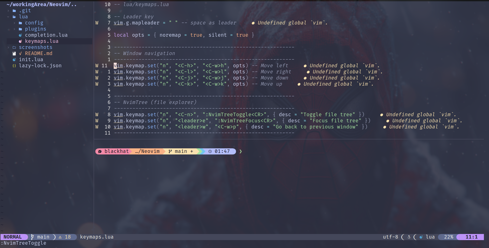
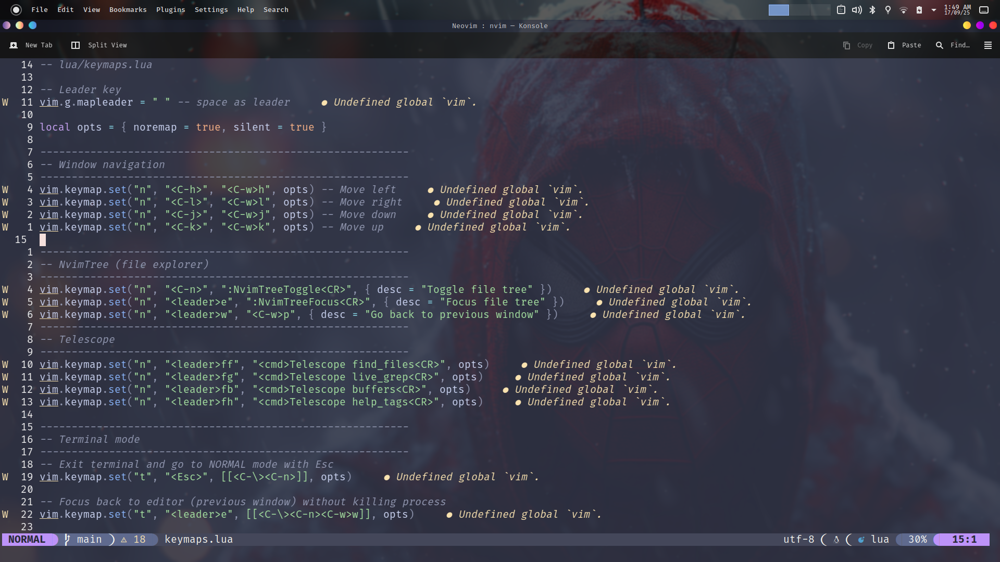
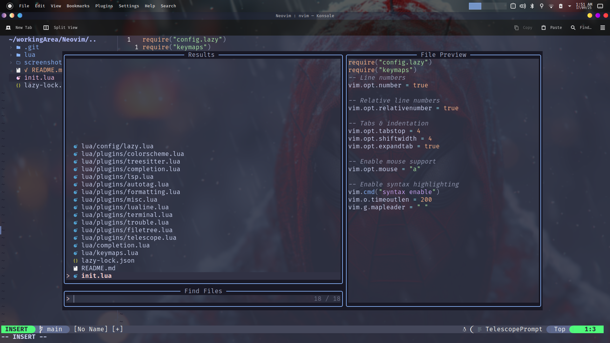

# 🚀 Custom Neovim Config

Welcome to My personalized Neovim setup! This configuration is designed for productivity, aesthetics, and ease of use. Below you'll find all the key shortcuts, plugin highlights, and a dedicated section for screenshots to showcase your beautiful editor.

---

## ✨ Features
- **Modern UI** with [Catppuccin](https://github.com/catppuccin/nvim) colorscheme
- **Intelligent Completion** powered by nvim-cmp & LuaSnip
- **LSP Support** for rich language features
- **File Explorer** with nvim-tree
- **Fuzzy Finder** using Telescope
- **Statusline** with Lualine
- **Autoformatting & Autotag** for web dev
- **Integrated Terminal** with ToggleTerm
- **Troubleshooting** via Trouble.nvim

---

## 🎹 Key Shortcuts


### Default Neovim Shortcuts
| Shortcut         | Action                        |
|------------------|-------------------------------|
| `:w`             | Save file                     |
| `:q`             | Quit Neovim                   |
| `:wq`            | Save and quit                 |
| `u`              | Undo                          |
| `Ctrl + r`       | Redo                          |
| `yy`             | Yank (copy) line              |
| `dd`             | Delete line                   |
| `p`              | Paste                         |
| `/text`          | Search for text               |
| `n`/`N`          | Next/prev search result       |
| `:noh`           | Clear search highlight        |
| `:split`/`:vsplit`| Split window horizontally/vertically |
| `Ctrl + h/j/k/l` | Move between windows          |

### Custom & Plugin Shortcuts
| Shortcut         | Action                        |
|------------------|-------------------------------|
| `<Space>e`       | Focus file explorer (NvimTree)|
| `<C-n>`          | Toggle file tree (NvimTree)   |
| `<Space>w`       | Go back to previous window    |
| `<Space>ff`      | Find files (Telescope)        |
| `<Space>fg`      | Live grep (Telescope)         |
| `<Space>fb`      | List buffers (Telescope)      |
| `<Space>fh`      | Help tags (Telescope)         |
| `<Space>tt`      | Toggle terminal (split)       |
| `<Space>t`       | Toggle terminal (ToggleTerm)  |
| `<Space>tv`      | Vertical terminal (ToggleTerm)|
| `<Space>tf`      | Floating terminal (ToggleTerm)|
| `<Esc>` (in terminal)| Exit to normal mode         |
| `<Space>rn`      | Rename symbol (LSP)           |
| `<Space>ca`      | Code action (LSP)             |
| `<Space>gd`      | Go to definition (LSP)        |
| `<Space>gr`      | Go to references (LSP)        |
| `<Space>gi`      | Go to implementation (LSP)    |
| `<Space>f`       | Format file (LSP)             |
| `<Space>cf`      | Format buffer (Conform)       |
| `<Space>q`       | Toggle Trouble (diagnostics)  |
| `<leader>xx`     | Workspace diagnostics (Trouble)|
| `<leader>xX`     | Buffer diagnostics (Trouble)  |
| `<leader>cs`     | Symbols (Trouble)             |
| `<leader>cl`     | LSP Definitions (Trouble)     |
| `<leader>xL`     | Location List (Trouble)       |
| `<leader>xQ`     | Quickfix List (Trouble)       |
| `gnn`            | Treesitter: init selection    |
| `grn`            | Treesitter: node incremental  |
| `grc`            | Treesitter: scope incremental |
| `grm`            | Treesitter: node decremental  |
| `Ctrl + /`       | Comment/uncomment line        |
| `Tab`/`Shift+Tab`| Cycle completion items        |
| `Ctrl + Space`   | Trigger completion            |
| `Ctrl + n/p`     | Next/prev completion item     |
| `Ctrl + d/f`     | Scroll docs in completion     |
| `<C-s>`          | Save file (normal/insert)     |
| `<C-q>`          | Quit Neovim                   |

*Leader key is set to `<Space>`*

---

## 🖼️ Screenshots






---

## 📦 Plugins Used
- [nvim-cmp](https://github.com/hrsh7th/nvim-cmp)
- [LuaSnip](https://github.com/L3MON4D3/LuaSnip)
- [nvim-tree.lua](https://github.com/nvim-tree/nvim-tree.lua)
- [telescope.nvim](https://github.com/nvim-telescope/telescope.nvim)
- [lualine.nvim](https://github.com/nvim-lualine/lualine.nvim)
- [nvim-treesitter](https://github.com/nvim-treesitter/nvim-treesitter)
- [toggleterm.nvim](https://github.com/akinsho/toggleterm.nvim)
- [trouble.nvim](https://github.com/folke/trouble.nvim)
- [catppuccin](https://github.com/catppuccin/nvim)

---

## 🛠️ How to Use
1. Clone this repo into your Neovim config directory:
   ```sh
   git clone https://github.com/Mr-BlackHat-lab/Custom-NeoVim-Editor.git ~/.config/nvim
   ```
2. Open Neovim and run `:Lazy sync` to install plugins.
3. Enjoy your custom workflow!

---

## 💡 Customization
- Edit `lua/keymaps.lua` to change shortcuts
- Tweak plugins in `lua/plugins/`
- Change theme in `lua/plugins/colorscheme.lua`

---

## 📣 Credits
Made with ❤️ by Prahalad Singh

---


> **Enjoy coding with your beautiful, powerful Neovim!**
